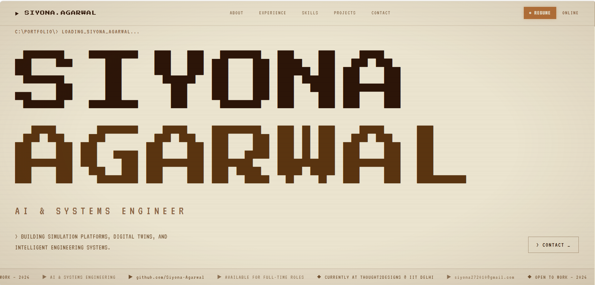

# 📡 SIYONA.AGARWAL PORTFOLIO

> Visit the [live site](https://siyona-agarwal.github.io/Portfolio) for a full interactive preview.

Hi, I'm Siyona! This is my portfolio — a collection of my projects, skills, and a bit about who I am.

## 🛠️ Tech Stack & Systems

The system is architected using highly decoupled, type-safe components optimized for fast loading and responsive micro-animations:

| Layer | Technology | Purpose |
| :--- | :--- | :--- |
| **Core Framework** | React 19 + TypeScript | High-performance reactive DOM state management |
| **Styling Engine** | Tailwind CSS + Plain CSS | Custom themed utilities & layout structures |
| **Animations** | Framer Motion | Smooth, hardware-accelerated transitions & sticky card decks |
| **Build System** | Vite | Ultra-fast bundling, HMR, and build pipelines |
| **Icons** | Lucide React | Clean, scalable vector system diagnostics icons |

---
